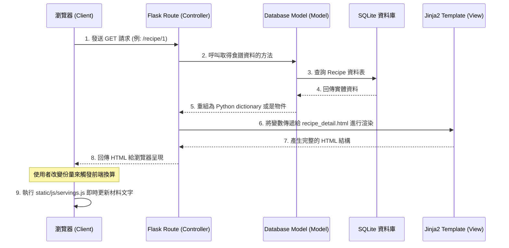

# 系統架構設計文件 (ARCHITECTURE) - 食譜收藏夾

## 1. 技術架構說明

本專案採用經典的伺服器渲染 (Server-Side Rendering) 架構，不區分前後端分離。透過 Flask 框架處理 HTTP 請求，並結合 Jinja2 模板引擎進行靜態頁面渲染，最後將完整的 HTML 回傳給瀏覽器。這樣的架構單純、結構清晰，非常適合快速開發與中小型應用。

### 選用技術與原因
- **後端框架：Python + Flask**
  - **原因**：輕量級且易於上手，具備極高的彈性，適合快速打造系統與迭代。對於不需要過多複雜依賴的「食譜收藏」系統是最佳選擇。
- **模板引擎：Jinja2**
  - **原因**：與 Flask 深度整合，能將 Python 變數與邏輯（如 `for` 迴圈、`if` 判斷）直接嵌入 HTML 中，方便渲染食譜資料與動態列表。
- **資料庫：SQLite**
  - **原因**：檔案型資料庫，不需要額外設定與架設資料庫伺服器，非常適合早期開發與輕量級應用。

### MVC 模式對應與說明
我們將依循 MVC（Model-View-Controller）概念來組織程式碼結構，達到關注點分離：
- **Model (模型)**：負責與 SQLite 互動，定義食譜、分類等資料的結構與讀寫邏輯。
- **View (視圖)**：Jinja2 模板與前端靜態檔案 (HTML/CSS/JS)，決定使用者最終看到的呈現畫面。
- **Controller (控制器)**：Flask 的路由 (Routes)。負責接收使用者的請求 (如提交表單、請求食譜頁面)，向 Model 索取資料，然後交由 View 處理。

---

## 2. 專案資料夾結構

本專案採用結構化的 Flask 目錄配置，確保程式碼有良好的維護性與可擴展性。

```text
web_app_development/
├── app/                        # 應用程式主目錄
│   ├── __init__.py             # 初始化 Flask app 與載入設定
│   ├── models/                 # 資料庫模型 (Model)
│   │   ├── __init__.py
│   │   └── recipe.py           # 定義食譜、分類與材料等資料表結構
│   ├── routes/                 # Flask 路由控制器 (Controller)
│   │   ├── __init__.py
│   │   ├── index.py            # 首頁與公共路由
│   │   └── recipe.py           # 食譜增刪改查相關路由
│   ├── templates/              # Jinja2 HTML 模板 (View)
│   │   ├── base.html           # 全站共用版型 (導覽列/頁尾)
│   │   ├── index.html          # 首頁 (食譜分類與列表)
│   │   └── recipe_detail.html  # 單一食譜詳細資訊頁
│   └── static/                 # 靜態資源檔案
│       ├── css/
│       │   └── style.css       # 樣式表
│       ├── js/
│       │   └── servings.js     # 份量自動換算邏輯腳本
│       └── images/             # 系統預設圖片檔
├── instance/                   # 存放不要進版控的執行階段檔案
│   └── database.db             # SQLite 資料庫檔案
├── uploads/                    # 統一存放使用者上傳的食譜照片
├── docs/                       # 專案說明文件
│   ├── PRD.md                  # 產品需求文件
│   └── ARCHITECTURE.md         # 系統架構設計文件 (本文件)
├── requirements.txt            # Python 相依套件清單
└── app.py                      # 程式啟動入口
```

---

## 3. 元件關係圖

以下圖表展示當使用者在瀏覽器中操作時，系統各元件是如何互相協作的流程：



---

## 4. 關鍵設計決策

1. **前端實作即時的「份量自動換算」邏輯：**
   - **原因**：為了提供順暢的使用者體驗，份量換算由前端 JavaScript 負責（定義於 `servings.js`）。當使用者切換「食用人數」時，可直接利用網頁上的既有基數進行重新計算與更新 DOM，不需再向後端伺服器發送額外請求，大幅降低延遲感與伺服器負載。

2. **路由 (Routes) 與 Blueprint 模組化拆分：**
   - **原因**：即便初期的功能只有 5 項，如果所有路由都集中寫在同一個 `app.py` 中，程式碼會很快變得雜亂無章。因此我們利用 Flask `Blueprint` 機制將首頁功能、食譜管理功能拆分成不同的檔案放置於 `app/routes/` 下，實現關注點分離。

3. **統一的基礎模板 `base.html` 繼承：**
   - **原因**：採用 Jinja2 提供的模板繼承（Template Inheritance）。全站的共同樣式、導覽列（Navbar）與頁尾（Footer）集中維護於 `base.html`。其他頁面只需擴充特有的 `` 區塊。這能避免產生大量的重複 HTML 程式碼，未來調整版位也更加輕鬆。

4. **將使用者上傳綁定與系統靜態檔案隔離：**
   - **原因**：專案資料夾結構明確區分了 `app/static`（系統內建圖片、CSS、JS）與外部的 `uploads/`（使用者上傳的內容）。這樣可以確保應用程式原始碼的純淨度，避免將使用者上傳的大量圖片與程式庫混雜，也有利於後期遷移至雲端儲存空間。
