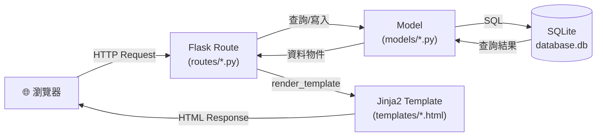
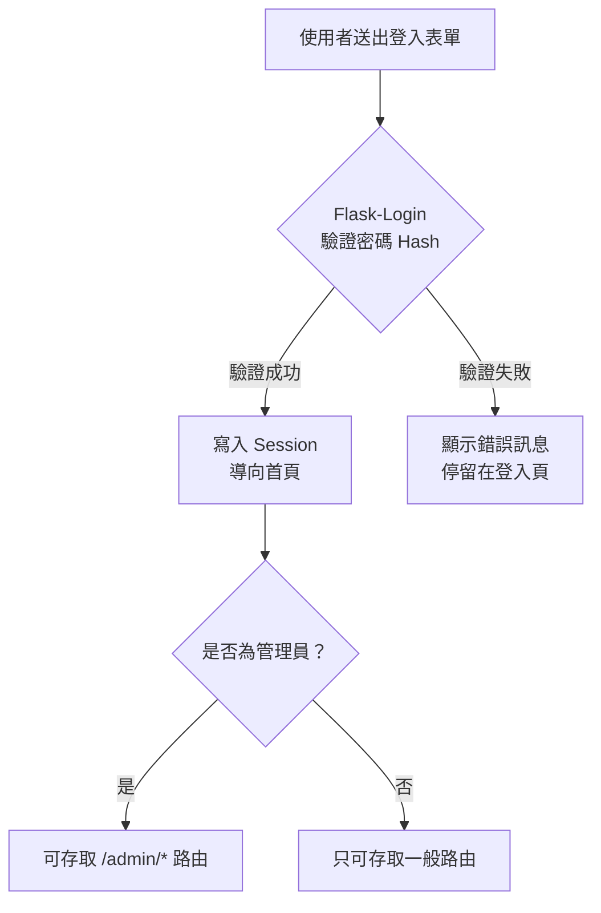
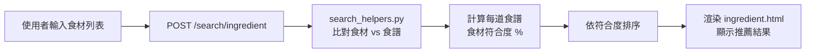

# ARCHITECTURE — 食譜收藏夾系統

> **版本**：v1.0
> **建立日期**：2026-05-07
> **依據**：docs/PRD.md

---

## 1. 技術架構說明

### 1.1 選用技術與原因

| 技術 | 選用原因 |
|------|----------|
| **Python Flask** | 輕量級後端框架，適合中小型 Web 專案，學習曲線低，社群豐富 |
| **Jinja2** | Flask 內建模板引擎，可在 HTML 中嵌入動態資料，不需前後端分離 |
| **SQLite + SQLAlchemy** | SQLite 零設定、單檔資料庫，適合開發與輕量部署；SQLAlchemy 提供 ORM 防止 SQL Injection |
| **Vanilla CSS + JavaScript** | 不依賴額外框架，降低學習門檻，適合初學團隊快速上手 |
| **Flask-Login** | 處理用戶登入、登出與 Session 管理，減少手刻驗證邏輯 |
| **Flask-WTF** | 表單驗證與 CSRF 防護，提升安全性 |

---

### 1.2 Flask MVC 模式說明

本專案採用 **MVC（Model-View-Controller）** 架構，職責分離清楚：

| 層級 | 對應位置 | 職責說明 |
|------|----------|----------|
| **Model（模型）** | `app/models/` | 定義資料表結構、與資料庫互動（CRUD 操作） |
| **View（視圖）** | `app/templates/` | Jinja2 HTML 模板，負責呈現資料給使用者 |
| **Controller（控制器）** | `app/routes/` | Flask 路由，接收請求 → 呼叫 Model → 渲染 View |

---

## 2. 專案資料夾結構

```
recipe-app/                        ← 專案根目錄
│
├── app/                           ← 主應用程式套件
│   ├── __init__.py                ← Flask app 工廠函式（create_app）
│   │
│   ├── models/                    ← 資料庫模型（Model 層）
│   │   ├── __init__.py
│   │   ├── user.py                ← 使用者模型（User）
│   │   ├── recipe.py              ← 食譜模型（Recipe）
│   │   ├── ingredient.py          ← 食材模型（Ingredient）
│   │   └── category.py            ← 分類標籤模型（Category）
│   │
│   ├── routes/                    ← 路由（Controller 層）
│   │   ├── __init__.py
│   │   ├── auth.py                ← 註冊、登入、登出
│   │   ├── recipes.py             ← 食譜 CRUD、瀏覽、詳細頁
│   │   ├── search.py              ← 關鍵字搜尋、食材組合搜尋
│   │   └── admin.py               ← 管理員後台路由
│   │
│   ├── templates/                 ← Jinja2 模板（View 層）
│   │   ├── base.html              ← 共用版型（導覽列、頁尾）
│   │   ├── index.html             ← 首頁（食譜列表）
│   │   ├── auth/
│   │   │   ├── login.html         ← 登入頁
│   │   │   └── register.html      ← 註冊頁
│   │   ├── recipes/
│   │   │   ├── list.html          ← 食譜列表頁（含分頁）
│   │   │   ├── detail.html        ← 食譜詳細頁
│   │   │   ├── create.html        ← 新增食譜表單
│   │   │   └── edit.html          ← 編輯食譜表單
│   │   ├── search/
│   │   │   ├── results.html       ← 搜尋結果頁
│   │   │   └── ingredient.html    ← 食材組合搜尋頁
│   │   └── admin/
│   │       ├── dashboard.html     ← 管理員後台首頁
│   │       ├── users.html         ← 用戶管理
│   │       └── recipes.html       ← 食譜管理
│   │
│   ├── static/                    ← 靜態資源
│   │   ├── css/
│   │   │   └── style.css          ← 主要樣式表
│   │   ├── js/
│   │   │   ├── search.js          ← 即時搜尋邏輯
│   │   │   └── ingredient.js      ← 食材標籤輸入邏輯
│   │   └── uploads/               ← 使用者上傳的食譜封面圖片
│   │
│   └── utils/                     ← 工具函式
│       ├── __init__.py
│       ├── auth_helpers.py        ← 驗證裝飾器（login_required, admin_required）
│       └── search_helpers.py      ← 食材組合搜尋演算法
│
├── instance/
│   └── database.db                ← SQLite 資料庫（不 commit 至 Git）
│
├── docs/                          ← 設計文件
│   ├── PRD.md
│   ├── ARCHITECTURE.md
│   └── ...
│
├── tests/                         ← 測試檔案（選填）
│   └── test_recipes.py
│
├── config.py                      ← 設定檔（DEBUG、SECRET_KEY、DB 路徑）
├── app.py                         ← 應用程式入口（run server）
├── requirements.txt               ← Python 套件清單
└── .gitignore                     ← 排除 instance/、__pycache__/ 等
```

---

## 3. 元件關係圖

### 3.1 請求流程總覽



### 3.2 用戶驗證流程



### 3.3 食材組合搜尋流程



---

## 4. 關鍵設計決策

### 決策 1：使用 SQLAlchemy ORM 而非原生 sqlite3

**決定**：透過 Flask-SQLAlchemy 操作資料庫，而非直接寫 SQL 字串。

**原因**：
- 防止 SQL Injection（參數化查詢由 ORM 自動處理）
- 程式碼更易讀，Model 定義即文件
- 未來若需要換資料庫（如 PostgreSQL），改動最小

---

### 決策 2：應用程式工廠模式（Application Factory）

**決定**：在 `app/__init__.py` 使用 `create_app()` 工廠函式初始化 Flask。

**原因**：
- 方便未來切換測試與生產環境的設定
- 避免循環 import 問題
- 多個 Blueprint 可以清楚分開 register

```python
# app/__init__.py 範例
def create_app(config=None):
    app = Flask(__name__)
    app.config.from_object(config or 'config.DevelopmentConfig')
    db.init_app(app)
    login_manager.init_app(app)
    # 註冊 Blueprint
    from app.routes.auth import auth_bp
    from app.routes.recipes import recipes_bp
    app.register_blueprint(auth_bp)
    app.register_blueprint(recipes_bp)
    return app
```

---

### 決策 3：使用 Flask Blueprint 分割路由

**決定**：每個功能模組（auth、recipes、search、admin）獨立為一個 Blueprint。

**原因**：
- 保持每個路由檔案職責單一，易於維護
- 團隊成員可以分工開發不同模組，減少衝突
- 可為不同 Blueprint 設定不同 URL prefix（如 `/admin`、`/auth`）

---

### 決策 4：食材組合搜尋採用後端計算

**決定**：食材搜尋在後端 Python 計算符合度，而非前端 JavaScript。

**原因**：
- 資料庫食材數量可能很大，前端計算效能差
- 後端可直接使用 SQLAlchemy 查詢，減少資料傳輸量
- 符合度演算法（交集除以聯集）在 Python 中易於實作與測試

**演算法概念**：
```
符合度 = 使用者輸入食材 ∩ 食譜所需食材
        ───────────────────────────────
              食譜所需食材總數
```

---

### 決策 5：圖片上傳儲存在本地 static/uploads/

**決定**：使用者上傳的封面圖片儲存至 `app/static/uploads/`，不使用外部儲存服務。

**原因**：
- MVP 階段簡化部署複雜度
- 本機開發不需要額外設定雲端存儲
- 需加入副檔名白名單驗證（`.jpg`, `.jpeg`, `.png`, `.webp`）防止惡意上傳

> ⚠️ **注意**：`instance/database.db` 與 `app/static/uploads/` 需加入 `.gitignore`，避免將資料庫或使用者圖片 commit 至 Git。

---

## 5. 環境設定與套件清單

### requirements.txt

```
Flask==3.0.0
Flask-SQLAlchemy==3.1.1
Flask-Login==0.6.3
Flask-WTF==1.2.1
Werkzeug==3.0.1
bcrypt==4.1.2
```

### config.py 架構

```python
class Config:
    SECRET_KEY = 'your-secret-key'
    SQLALCHEMY_TRACK_MODIFICATIONS = False
    MAX_CONTENT_LENGTH = 5 * 1024 * 1024  # 圖片最大 5MB

class DevelopmentConfig(Config):
    DEBUG = True
    SQLALCHEMY_DATABASE_URI = 'sqlite:///database.db'

class ProductionConfig(Config):
    DEBUG = False
    SQLALCHEMY_DATABASE_URI = 'sqlite:///database.db'
```

---

*此文件由 AI Agent 依據 Architecture Skill 與 PRD.md 自動產出，請團隊成員審閱並視需要調整。*
