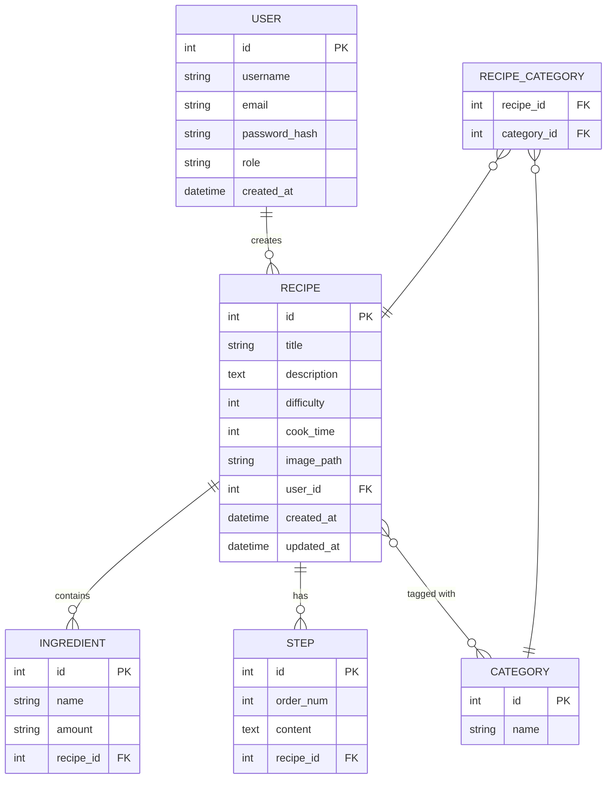

# DB_DESIGN — 食譜收藏夾系統

> **版本**：v1.0
> **建立日期**：2026-05-07
> **依據**：docs/PRD.md、docs/FLOWCHART.md、docs/ARCHITECTURE.md

---

## 1. ER 圖（實體關係圖）

---

## 2. 資料表詳細說明

### 2.1 `users` — 使用者

| 欄位名稱 | 型別 | 必填 | 說明 |
|----------|------|------|------|
| `id` | INTEGER | ✅ | 主鍵，自動遞增 |
| `username` | TEXT | ✅ | 使用者顯示名稱，唯一值 |
| `email` | TEXT | ✅ | 登入用 Email，唯一值 |
| `password_hash` | TEXT | ✅ | bcrypt 加密後的密碼，不存明文 |
| `role` | TEXT | ✅ | 角色：`user`（一般）或 `admin`（管理員） |
| `created_at` | DATETIME | ✅ | 帳號建立時間，預設為現在 |

**關聯**：一個 User 可以建立多個 Recipe（一對多）

---

### 2.2 `recipes` — 食譜

| 欄位名稱 | 型別 | 必填 | 說明 |
|----------|------|------|------|
| `id` | INTEGER | ✅ | 主鍵，自動遞增 |
| `title` | TEXT | ✅ | 食譜名稱 |
| `description` | TEXT | ❌ | 食譜簡介 |
| `difficulty` | INTEGER | ✅ | 難度係數 1–5（1=新手, 5=進階） |
| `cook_time` | INTEGER | ❌ | 烹飪時間（分鐘） |
| `image_path` | TEXT | ❌ | 封面圖片路徑（相對於 static/uploads/） |
| `user_id` | INTEGER | ✅ | 外鍵 → users.id（作者） |
| `created_at` | DATETIME | ✅ | 建立時間 |
| `updated_at` | DATETIME | ✅ | 最後更新時間 |

**關聯**：
- 多個 Ingredient（一對多）
- 多個 Step（一對多）
- 多個 Category（多對多，透過 recipe_category）

---

### 2.3 `ingredients` — 食材

| 欄位名稱 | 型別 | 必填 | 說明 |
|----------|------|------|------|
| `id` | INTEGER | ✅ | 主鍵，自動遞增 |
| `name` | TEXT | ✅ | 食材名稱（如：雞蛋、番茄） |
| `amount` | TEXT | ❌ | 份量（如：2顆、100g） |
| `recipe_id` | INTEGER | ✅ | 外鍵 → recipes.id |

---

### 2.4 `steps` — 烹飪步驟

| 欄位名稱 | 型別 | 必填 | 說明 |
|----------|------|------|------|
| `id` | INTEGER | ✅ | 主鍵，自動遞增 |
| `order_num` | INTEGER | ✅ | 步驟順序（從 1 開始） |
| `content` | TEXT | ✅ | 步驟說明文字 |
| `recipe_id` | INTEGER | ✅ | 外鍵 → recipes.id |

---

### 2.5 `categories` — 分類標籤

| 欄位名稱 | 型別 | 必填 | 說明 |
|----------|------|------|------|
| `id` | INTEGER | ✅ | 主鍵，自動遞增 |
| `name` | TEXT | ✅ | 分類名稱（如：早餐、甜點、素食），唯一值 |

---

### 2.6 `recipe_category` — 食譜分類關聯表（多對多）

| 欄位名稱 | 型別 | 必填 | 說明 |
|----------|------|------|------|
| `recipe_id` | INTEGER | ✅ | 外鍵 → recipes.id |
| `category_id` | INTEGER | ✅ | 外鍵 → categories.id |

**複合主鍵**：`(recipe_id, category_id)`

---

## 3. 資料表關聯總覽

| 關聯 | 類型 | 說明 |
|------|------|------|
| `users` → `recipes` | 一對多（1:N） | 一個用戶可建立多道食譜 |
| `recipes` → `ingredients` | 一對多（1:N） | 一道食譜包含多個食材 |
| `recipes` → `steps` | 一對多（1:N） | 一道食譜包含多個步驟 |
| `recipes` ↔ `categories` | 多對多（M:N） | 一道食譜可有多個標籤，一個標籤含多道食譜 |
