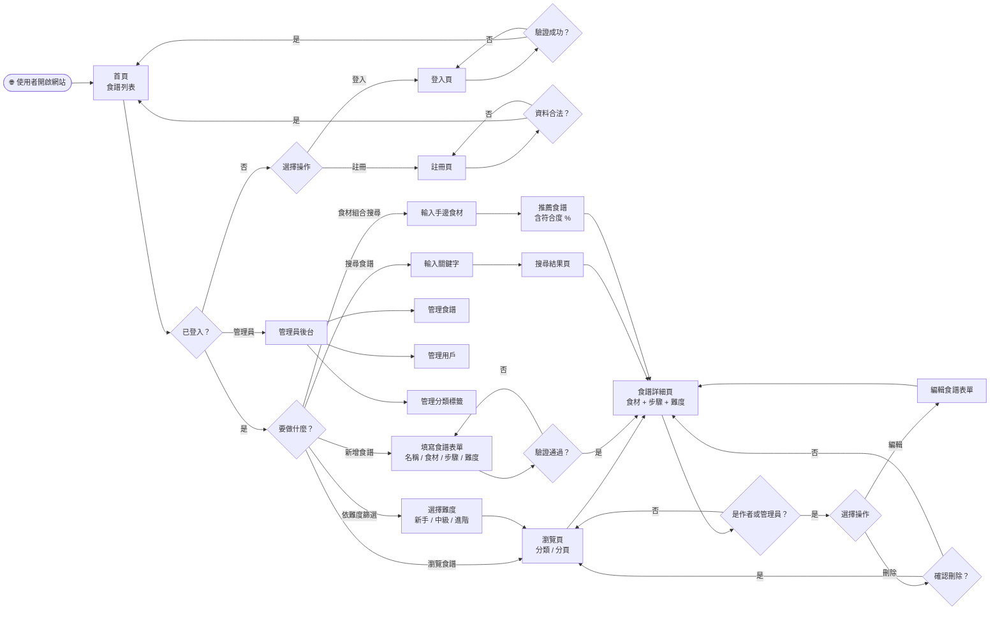
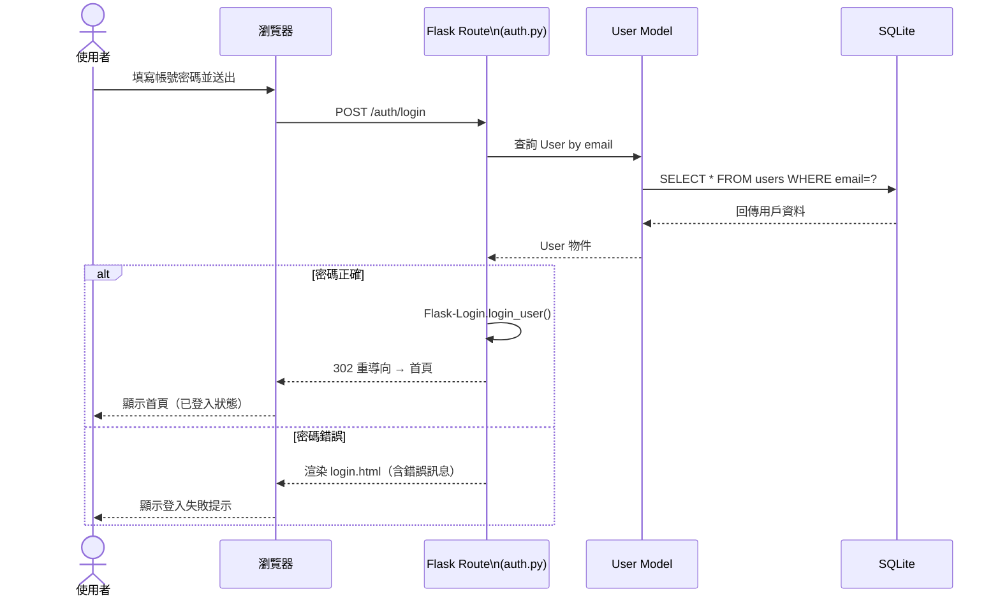
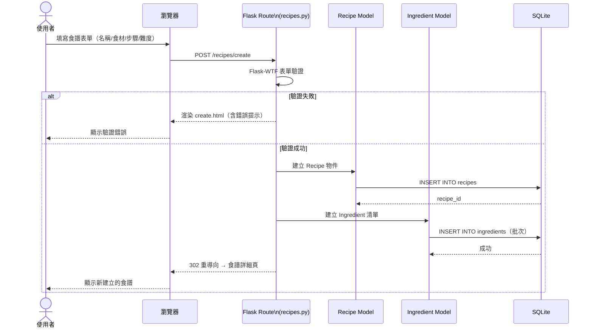
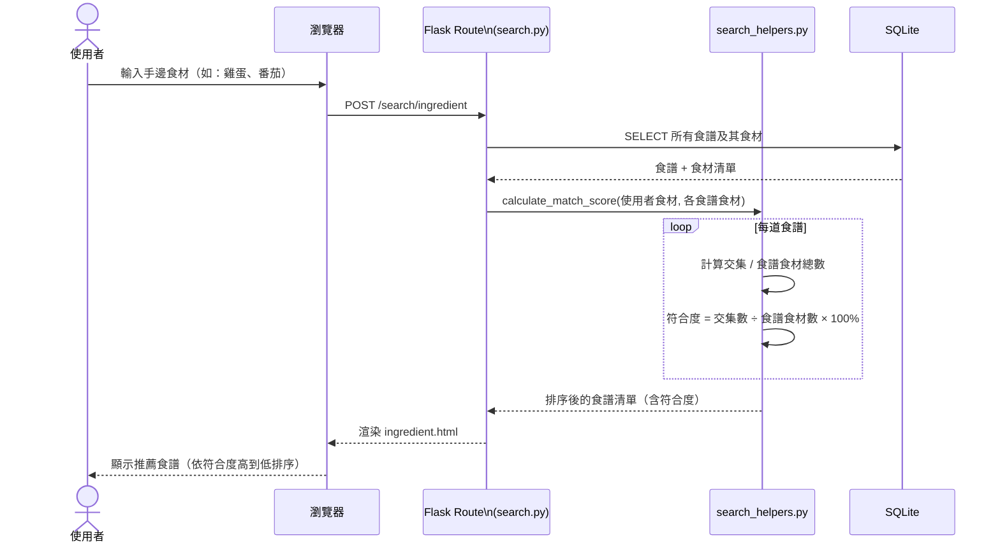
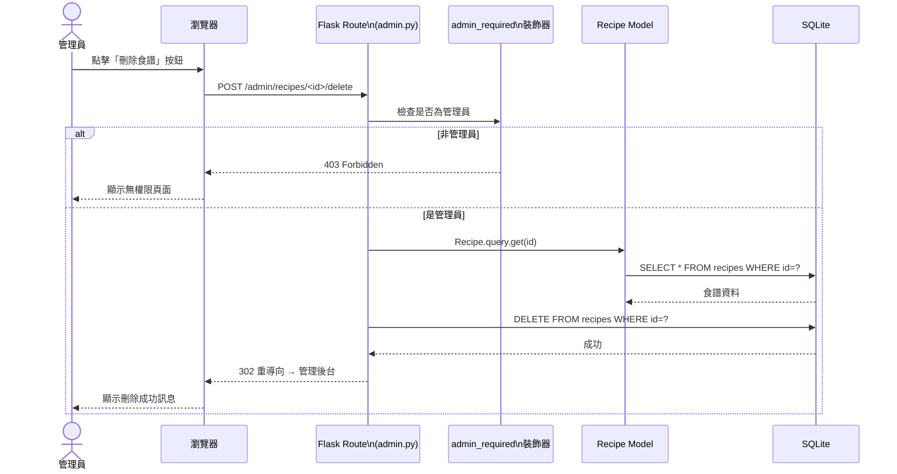

# FLOWCHART — 食譜收藏夾系統

> **版本**：v1.0
> **建立日期**：2026-05-07
> **依據**：docs/PRD.md、docs/ARCHITECTURE.md

---

## 1. 使用者流程圖（User Flow）

描述使用者從進入網站到完成各項主要操作的完整路徑。

---

## 2. 系統序列圖（Sequence Diagram）

### 2.1 用戶登入流程

---

### 2.2 新增食譜流程

---

### 2.3 食材組合搜尋流程

---

### 2.4 管理員刪除食譜流程

---

## 3. 功能清單對照表

| 功能 | URL 路徑 | HTTP 方法 | 說明 | 需登入 | 需管理員 |
|------|----------|-----------|------|--------|----------|
| 首頁 / 食譜列表 | `/` | GET | 顯示所有公開食譜，支援分類篩選與分頁 | ❌ | ❌ |
| 食譜詳細頁 | `/recipes/<id>` | GET | 顯示單一食譜的完整食材與步驟 | ❌ | ❌ |
| 新增食譜 | `/recipes/create` | GET / POST | GET 顯示表單；POST 儲存食譜 | ✅ | ❌ |
| 編輯食譜 | `/recipes/<id>/edit` | GET / POST | GET 顯示預填表單；POST 更新食譜 | ✅ | ❌ |
| 刪除食譜 | `/recipes/<id>/delete` | POST | 刪除食譜（只有作者或管理員可操作） | ✅ | ❌ |
| 關鍵字搜尋 | `/search` | GET | 依 `q` 參數搜尋食譜名稱 | ❌ | ❌ |
| 食材組合搜尋 | `/search/ingredient` | GET / POST | GET 顯示輸入頁；POST 回傳推薦清單 | ❌ | ❌ |
| 難度篩選 | `/recipes?difficulty=<n>` | GET | 依難度係數（1–5）篩選食譜列表 | ❌ | ❌ |
| 分類篩選 | `/recipes?category=<id>` | GET | 依分類標籤篩選食譜列表 | ❌ | ❌ |
| 用戶註冊 | `/auth/register` | GET / POST | GET 顯示表單；POST 建立帳號 | ❌ | ❌ |
| 用戶登入 | `/auth/login` | GET / POST | GET 顯示表單；POST 驗證登入 | ❌ | ❌ |
| 用戶登出 | `/auth/logout` | GET | 清除 Session，重導首頁 | ✅ | ❌ |
| 管理員後台首頁 | `/admin/` | GET | 顯示統計數據（食譜數、用戶數） | ✅ | ✅ |
| 管理員：食譜管理 | `/admin/recipes` | GET | 列出所有食譜，可操作刪除 | ✅ | ✅ |
| 管理員：用戶管理 | `/admin/users` | GET | 列出所有用戶，可封鎖或刪除 | ✅ | ✅ |
| 管理員：分類管理 | `/admin/categories` | GET / POST | 新增或刪除分類標籤 | ✅ | ✅ |

---

*此文件由 AI Agent 依據 Flowchart Skill 自動產出，Mermaid 語法可在 GitHub、Notion、Obsidian 等平台直接渲染預覽。*
