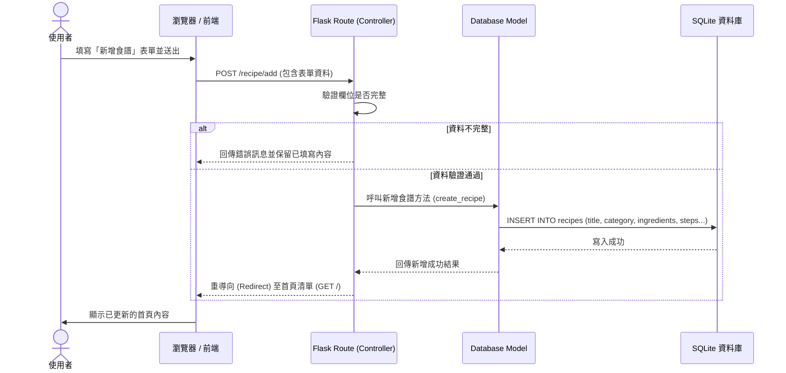

# 流程圖文件 (FLOWCHART) - 食譜收藏夾

本文件根據 PRD 需求與架構設計，描繪了使用者的操作路徑（User Flow）、系統新增資料的序列圖（Sequence Diagram）以及各功能對應的 URL 路徑清單。

---

## 1. 使用者流程圖（User Flow）

此流程圖展示了使用者進入網站後，如何瀏覽清單、進行分類篩選、檢視食譜細節以及新增食譜的完整操作路徑。

```mermaid
flowchart LR
    Start([使用者開啟網站]) --> Home[首頁 - 食譜列表]
    
    Home --> Action{要進行什麼操作？}
    
    %% 瀏覽與篩選
    Action -->|選擇分類標籤| Filter[刷新列表 (特定分類食譜)]
    Filter --> Action
    
    %% 查看詳細與份量換算
    Action -->|點擊某個食譜| Detail[食譜詳細資訊頁面]
    Detail --> Read[閱讀：材料清單與烹飪步驟]
    Detail --> ChangeServing[選擇目標份量數量]
    ChangeServing --> JS[前端 JS 即時重算並更新材料頁面]
    JS --> Read
    Detail -->|返回首頁| Home
    
    %% 新增食譜
    Action -->|點選新增食譜| AddForm[進入新增食譜表單頁]
    AddForm --> Fill[填寫名稱、分類、材料與步驟等]
    Fill --> Submit[點擊送出]
    Submit --> Save{後端驗證與儲存}
    Save -->|成功| Home
    Save -->|失敗| AddForm
```

---

## 2. 系統序列圖（Sequence Diagram）

此序列圖描述了「使用者點擊新增食譜」直到「資料存入資料庫」並導向回首頁的完整系統後端與資料庫互動流程。



---

## 3. 功能清單與 URL 對照表

為方便後續前後端開發的對齊，將 PRD 的主要功能對應至 Flask 將要實作的 URL 路徑與 HTTP 方法：

| 功能描述 | HTTP 方法 | URL 路徑 | 負責元件 / 說明 |
| :--- | :---: | :--- | :--- |
| **首頁（預設顯示所有食譜）** | GET | `/` | Flask Route `index()` + `index.html` |
| **食譜分類（依據所選分類篩選）** | GET | `/?category={name}` | Flask Route (透過參數判斷回傳結果) |
| **新增食譜（取得表單頁面）** | GET | `/recipe/add` | Flask Route `add_recipe_form()` |
| **新增食譜（送出與儲存）** | POST | `/recipe/add` | Flask Route `add_recipe_submit()` |
| **檢視食譜詳細資訊**（含步驟與材料） | GET | `/recipe/<id>` | Flask Route `recipe_detail(id)` |
| **份量自動換算** | 無 | 前端 JS 處理 | static/js/servings.js (不發送 HTTP 請求) |
